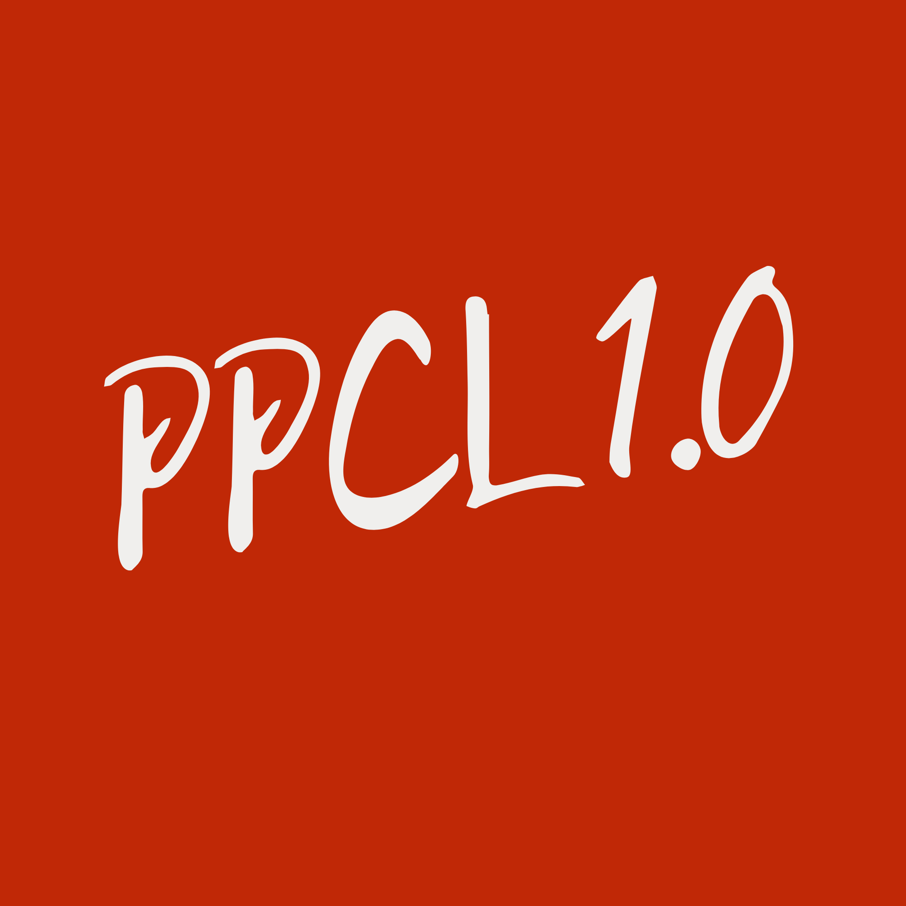
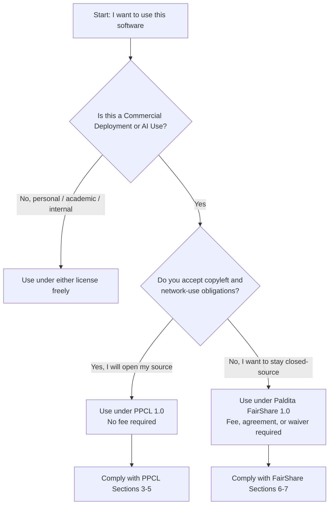

<p align="center">
  
</p>

<h1 align="center">PPCL 1.0</h1>
<p align="center"><strong>Paldita Public Copyleft License</strong> &mdash; with a commercial alternative, Paldita FairShare</p>

<p align="center">
  <a href="./LICENSE.txt"></a>
  <a href="./LICENSE-FAIRSHARE.txt"></a>
  
  
</p>

<p align="center">
  <a href="#overview">Overview</a> &middot;
  <a href="#which-license-applies-to-you">Which License Applies to You</a> &middot;
  <a href="#license-comparison">License Comparison</a> &middot;
  <a href="#repository-contents">Repository Contents</a> &middot;
  <a href="#applying-a-license-to-your-project">Applying a License</a> &middot;
  <a href="#adding-this-logo-to-a-readme-on-github">Logo on GitHub</a> &middot;
  <a href="#governance">Governance</a> &middot;
  <a href="#faq">FAQ</a>
</p>

---

## Overview

This repository defines two related, independently usable licenses, both jointly created and owned by Eishit Nigam and Paldita, and administered by the Paldita Team:

| License | File | Model | Core protection |
|---|---|---|---|
| **Paldita Public Copyleft License (PPCL) 1.0** | `LICENSE.txt` | Free, copyleft | Network-use clause closes the SaaS loophole; no fees, no field-of-endeavor restriction |
| **Paldita FairShare License 1.0** | `LICENSE-FAIRSHARE.txt` | Source-available, commercial | Permissive for non-commercial use; commercial and AI deployment require a fee, agreement, or waiver |

A project licensor chooses **one** of the two to apply to a given codebase. They are not meant to be stacked on the same code at the same time; they are alternatives serving different goals.

## Which License Applies to You



In short: **PPCL is free if you stay open. FairShare is paid if you stay closed.** There is no path that is both closed-source and free.

## License Comparison

| Term | PPCL 1.0 | FairShare 1.0 |
|---|---|---|
| Cost for non-commercial use | Free | Free |
| Cost for commercial deployment | Free | Fee, agreement, or waiver |
| Must release modified source if distributed | Yes | No |
| Must release source if run as a hosted service | Yes (Network Use clause) | No |
| AI/ML training use | Permitted; derivative-work clause may apply | Permitted; fee may apply for commercial AI use |
| Patent retaliation clause | Yes | Yes |
| Termination cure period | 30 days | 30 days |
| OSI / FSF eligible by design | Yes (pending formal review) | No |
| Best suited for | Projects that want maximum community reach and copyleft protection | Projects that want commercial revenue from companies that won't open-source |

## Repository Contents

```
.
├── README.md                 This file
├── LICENSE.txt                Paldita Public Copyleft License (PPCL) 1.0
├── LICENSE-FAIRSHARE.txt      Paldita FairShare License 1.0
└── assets/
    └── ppcl-logo.png          Project wordmark used above
```

## Applying a License to Your Project

1. Choose one license — PPCL or FairShare — for the codebase in question.
2. Copy the corresponding file (`LICENSE.txt` or `LICENSE-FAIRSHARE.txt`) into the root of your repository, renamed to `LICENSE`.
3. Add a short header to your primary source files:

   ```
   Copyright (C) <year> <your name>
   Licensed under the Paldita Public Copyleft License, Version 1.0.
   See the LICENSE file for full terms.
   ```

   or, for FairShare:

   ```
   Copyright (C) <year> <your name>
   Licensed under the Paldita FairShare License, Version 1.0.
   Commercial and AI use are subject to additional terms in LICENSE.
   ```

4. Add the SPDX identifier where your tooling supports it:

   ```
   SPDX-License-Identifier: PPCL-1.0
   ```

   ```
   SPDX-License-Identifier: LicenseRef-Paldita-FairShare-1.0
   ```

   The `LicenseRef-` prefix is the standard SPDX convention for licenses that are not on the official SPDX list — it keeps tooling accurate without falsely implying registration.


## Governance

Both licenses are jointly created and owned by **Eishit Nigam** and **Paldita**. The **Paldita Team** is the body responsible for day-to-day administration: publishing future license versions, issuing FairShare fee schedules, evaluating waiver requests, and providing written determinations on disputed terms (such as the "Substantial Portion" definition in the FairShare license). Decisions affecting both licenses jointly are expected to be made by agreement between Eishit Nigam and Paldita; that internal governance arrangement is outside the scope of either license document and should be defined separately.

## FAQ

**Why are there two licenses instead of one?**
They serve different goals. PPCL maximizes reach and guarantees that improvements stay open, including when run as a service. FairShare instead lets a commercial user keep its code closed, in exchange for a fee, an agreement, or a waiver. Projects that want both options available, the way some open-core companies operate, can offer the same codebase under either license at the licensor's discretion.

**Is PPCL officially approved by the Open Source Initiative or the Free Software Foundation?**
Not yet. It is designed to meet their published definitions, but formal approval requires submission to the OSI's public license-review process and a board decision, which has not occurred. Treat its current status as "community review," not "certified."

**Does either license restrict who can use the software?**
No. Neither license restricts use by field of endeavor. PPCL never requires payment under any circumstance. FairShare permits all non-commercial use without payment and conditions only Commercial Deployment and AI Use on the terms in its Section 6.

**Can I dual-license my own derivative work?**
Only the Copyright Holder can dual-license the original Software. If you create a derivative work under PPCL, your derivative must remain under PPCL or a compatible successor version; it cannot be relicensed under FairShare or any incompatible terms.

---

<p align="center"><sub>Copyright (C) 2026 Eishit Nigam and Paldita. Maintained by the Paldita Team.</sub></p>
